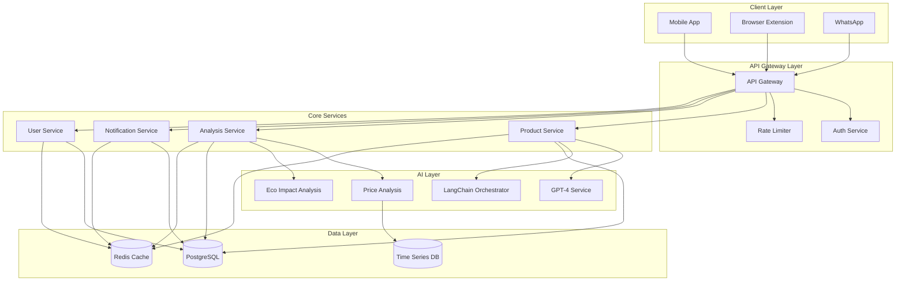

# SlowBuy.ai System Architecture

## System Overview

SlowBuy.ai is built on a modern, scalable microservices architecture designed to handle high-throughput product analysis and notification delivery. The system comprises several key components that work together to deliver a seamless user experience.

## Architecture Diagram



## Tech Stack Details

### Frontend Technologies

1. **Next.js 14+**
   - Server components for improved performance
   - App Router for simplified routing
   - API routes for backend functionality
   - Built-in TypeScript support
   - Automatic code splitting
   - Image optimization

2. **React Native**
   - Cross-platform mobile development
   - Native share extension support
   - Performance optimization
   - Offline capabilities
   - Push notification handling

3. **TailwindCSS**
   - Utility-first CSS framework
   - Custom design system
   - Responsive design
   - Dark mode support
   - Performance optimization

### Backend Technologies

1. **Node.js with Express**
   - RESTful API endpoints
   - Middleware support
   - TypeScript integration
   - Error handling
   - Request validation

2. **PostgreSQL with Prisma**
   - Type-safe database queries
   - Schema migrations
   - Relation management
   - Query optimization
   - Data validation

3. **Redis**
   - Caching layer
   - Session management
   - Rate limiting
   - Job queues
   - Real-time updates

### AI/ML Stack

1. **OpenAI GPT-4**
   - Product analysis
   - Review summarization
   - Recommendation generation
   - Natural language processing
   - Content generation

2. **LangChain**
   - AI workflow orchestration
   - Prompt management
   - Memory systems
   - Output parsing
   - Chain composition

### Infrastructure

1. **Vercel**
   - Frontend deployment
   - Edge functions
   - Analytics
   - CDN
   - SSL/TLS

2. **AWS**
   - ECS for containerization
   - S3 for storage
   - CloudWatch for monitoring
   - Route 53 for DNS
   - WAF for security

3. **Upstash**
   - Serverless Redis
   - Cross-region replication
   - Rate limiting
   - Job scheduling
   - Analytics

## System Components

### 1. Share Extension
```typescript
interface ShareExtension {
  platforms: ['iOS', 'Android', 'Web'];
  supportedUrls: RegExp[];
  handlers: {
    validateUrl(url: string): Promise<boolean>;
    extractProductId(url: string): Promise<string>;
    submitForAnalysis(productId: string): Promise<void>;
  };
}
```

### 2. AI Research Engine
```typescript
interface ResearchEngine {
  analyzers: {
    product: ProductAnalyzer;
    price: PriceAnalyzer;
    environmental: EnvironmentalAnalyzer;
    alternatives: AlternativeFinder;
  };
  queue: AnalysisQueue;
  storage: AnalysisStorage;
}
```

### 3. Notification System
```typescript
interface NotificationSystem {
  channels: {
    push: PushNotification;
    whatsapp: WhatsAppNotification;
    email: EmailNotification;
  };
  scheduler: NotificationScheduler;
  templates: NotificationTemplates;
}
```

### 4. Decision Dashboard
```typescript
interface Dashboard {
  recommendations: RecommendationEngine;
  visualizations: DataVisualization;
  interactions: UserInteractions;
  storage: DashboardStorage;
}
```

## Data Flow

1. **Product URL Submission**
   ```mermaid
   sequenceDiagram
       User->>Share Extension: Submit URL
       Share Extension->>API Gateway: Validate & Submit
       API Gateway->>Product Service: Create Analysis Job
       Product Service->>Analysis Queue: Schedule Analysis
       Analysis Queue->>User: Confirm Receipt
   ```

2. **Analysis Process**
   ```mermaid
   sequenceDiagram
       Analysis Queue->>AI Service: Start Analysis
       AI Service->>Product Service: Extract Info
       AI Service->>Price Service: Get History
       AI Service->>Eco Service: Get Impact
       AI Service->>Storage: Save Results
   ```

3. **Notification Delivery**
   ```mermaid
   sequenceDiagram
       Scheduler->>Notification Service: Trigger Daily Insight
       Notification Service->>Template Engine: Generate Content
       Template Engine->>Delivery Service: Format Message
       Delivery Service->>User: Send Notification
   ```

## Security Measures

1. **Authentication & Authorization**
   - Clerk for user authentication
   - JWT token validation
   - Role-based access control
   - Session management

2. **Data Protection**
   - End-to-end encryption
   - At-rest encryption
   - Secure key management
   - Regular security audits

3. **API Security**
   - Rate limiting
   - Input validation
   - CORS policies
   - API key management

4. **Infrastructure Security**
   - WAF configuration
   - DDoS protection
   - Network isolation
   - Regular updates

## Monitoring & Observability

1. **Metrics Collection**
   - Request latency
   - Error rates
   - System resources
   - User engagement

2. **Logging**
   - Structured logging
   - Error tracking
   - Audit trails
   - Performance monitoring

3. **Alerting**
   - Service health
   - Error thresholds
   - Resource utilization
   - Security incidents

## Scaling Strategy

1. **Horizontal Scaling**
   - Auto-scaling groups
   - Load balancing
   - Database sharding
   - Cache distribution

2. **Performance Optimization**
   - CDN utilization
   - Query optimization
   - Caching strategies
   - Background processing

3. **Resource Management**
   - Container orchestration
   - Memory optimization
   - Connection pooling
   - Resource quotas 